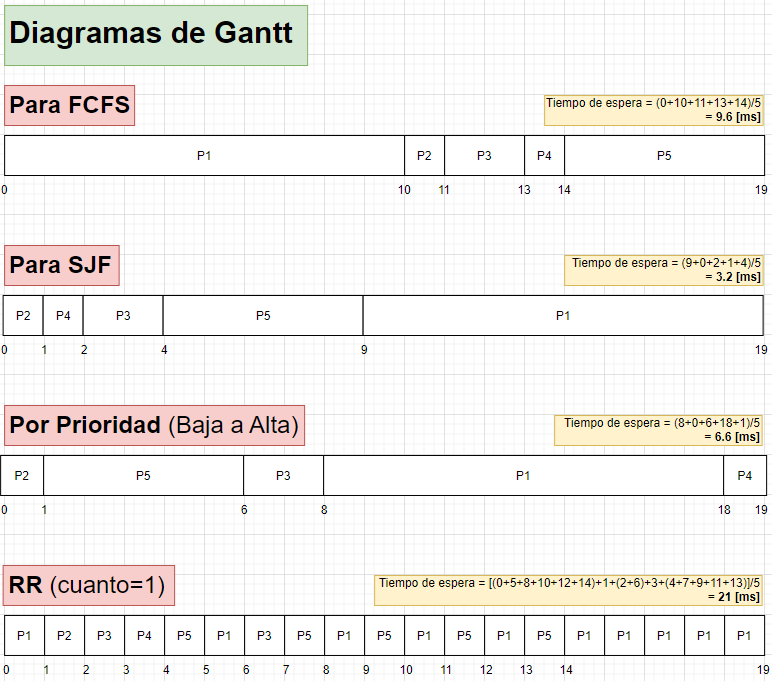

# **Solución Investigación 05**

## **1. Por qué es importante para un planificador diferenciar entre un programa limitado por I/O y por CPU?**

Es importante porque al diferenciar entre programas limitados por I/O y por CPU, el planificador puede optimizar la asignación de recursos del sistema operativo, garantizando un uso eficiente de la CPU y un manejo adecuado de las operaciones de I/O, lo que a su vez mejora el rendimiento general del sistema.

Un programa limitado por E/S implica la realización frecuente de operaciones de entrada/salida con dispositivos externos, como discos duros, unidades flash USB, impresoras, monitores y parlantes, entre otros. Estas operaciones son generalmente más lentas que las operaciones de procesamiento de la CPU, lo cual implica que el programa puede requerir esperar a que se completen estas operaciones antes de poder continuar su ejecución. Para asegurar una utilización eficiente de los recursos, el planificador debe evitar que estos procesos consuman innecesariamente la CPU. En ese sentido, un planificador efectivo para este tipo de programa será capaz de detectar cuándo un proceso está esperando una operación de E/S y realizar un cambio a otro proceso que no esté en espera de dicha operación. De esta manera, se optimiza la asignación de los recursos del sistema operativo y se garantiza un uso eficiente de la CPU, lo que contribuye a mejorar el rendimiento global del sistema.
Y un programa limitado por CPU se caracteriza por requerir principalmente el procesamiento de datos y cálculos complejos. Estos programas no realizan muchas operaciones de E/S y su rendimiento depende principalmente de la velocidad de la CPU y la cantidad de núcleos disponibles. En este caso, el planificador debe asegurarse de que los procesos que requieren una mayor capacidad de CPU no sean interrumpidos de manera innecesaria por procesos que necesitan menos tiempo de CPU.

## **2. Como entran en conflicto en determinadas configuraciones la utilización de CPU y tiempo de respuesta?**

Si se prioriza en exceso el tiempo de respuesta, puede limitarse la cantidad de procesos en ejecución, lo que implica interrumpir aquellos que utilizan intensivamente la CPU. Encontrar un equilibrio óptimo es crucial para maximizar la eficiencia y brindar una experiencia satisfactoria al usuario. El planificador debe tomar decisiones inteligentes considerando la carga de trabajo y la capacidad de la CPU, buscando optimizar el rendimiento general. De esta manera, se evita tanto la sobrecarga innecesaria como la ralentización excesiva, logrando un funcionamiento fluido y eficiente del sistema.

## **3. Como entran en conflicto en determinadas configuraciones el tiempo medio de procesamiento y tiempo máximo de espera?**

Existe un conflicto potencial entre el tiempo medio de procesamiento y el tiempo máximo de espera, debido a la asignación de recursos y la priorización de procesos. El tiempo medio de procesamiento representa el promedio de tiempo requerido para completar los procesos, mientras que el tiempo máximo de espera indica el límite máximo de tiempo que un proceso está dispuesto a esperar antes de recibir una respuesta. Si un proceso tiene un tiempo máximo de espera muy corto, es posible que sea interrumpido antes de finalizar su trabajo. Por otro lado, si el tiempo medio de procesamiento es prolongado, los procesos pueden acumularse en la cola de espera, afectando el tiempo máximo de espera.

Si se prioriza excesivamente el tiempo medio de procesamiento en detrimento del tiempo máximo de espera, los procesos que demandan más tiempo de CPU pueden recibir una ventaja injusta, dejando a los procesos más pequeños esperando indefinidamente. Por el contrario, si se da prioridad al tiempo máximo de espera sacrificando el tiempo medio de procesamiento, los procesos que requieren más tiempo de CPU pueden ser interrumpidos antes de su finalización, lo cual afectaría la eficiencia del sistema y la calidad del servicio. Es crucial encontrar un equilibrio adecuado entre el tiempo medio de procesamiento y el tiempo máximo de espera para garantizar que todos los procesos tengan una oportunidad justa de completarse y que los procesos que requieren más tiempo de CPU no sean interrumpidos innecesariamente. De esta manera, se optimiza el rendimiento del sistema y se asegura una experiencia satisfactoria para los usuarios.

## **4. Como entran en conflicto en determinadas configuraciones la utilización de los dispositivos I/O y la utilización de la CPU?**

Cuando un proceso necesita acceder a un dispositivo de entrada/salida, como un disco duro o una impresora, envía una solicitud al controlador correspondiente. La CPU espera a que el controlador procese la solicitud antes de continuar. Si varios procesos requieren acceso al mismo dispositivo, la CPU puede inactivarse mientras el controlador atiende las solicitudes pendientes. Esto resulta en una baja utilización de la CPU y una ralentización del sistema.

Por otro lado, si la CPU está ocupada procesando otros procesos y no puede atender las solicitudes de entrada/salida, se crea un cuello de botella en el rendimiento. Los procesos en espera pueden experimentar retrasos significativos. Para evitar este conflicto, los planificadores deben equilibrar la utilización de los dispositivos de entrada/salida y la CPU. Un planificador de E/S puede optimizar el uso de los dispositivos y reducir los tiempos de espera. Además, se puede dar prioridad a los procesos que requieren acceso a los dispositivos de entrada/salida, asegurando que la CPU esté disponible para atender las solicitudes de E/S.

## **5. Considere el siguiente conjunto de procesos, todos llegan al mismo tiempo en el orden del subíndice: Dibuje el diagrama de Gantt para FCFS, SJF, por prioridades (# de prioridad baja = a alta prioridad) y RR (cuanto = 1).**

## **6. Cual es el tiempo de ejecución de cada proceso para cada algoritmo?**

El tiempo de ejecución de cada proceso se ve afectado por el algoritmo de planificación implementado y las características individuales del proceso y el sistema en cuestión.

- **FCFS (Primero en llegar, primero en ser atendido):** El tiempo de ejecución de cada proceso se determina por el momento en que llega al sistema y la cantidad de tiempo de CPU que requiere. Los procesos se ejecutan en el orden de llegada, lo que significa que los primeros en llegar son los primeros en ejecutarse. Los procesos con mayores necesidades de tiempo de CPU tendrán una duración de ejecución más larga, lo que potencialmente puede retrasar la finalización de otros procesos.
- **SJF (Primero el trabajo más corto):** El tiempo de ejecución de cada proceso está determinado por los requerimientos de tiempo de CPU de cada uno. Los procesos se ejecutan en orden ascendente de duración, comenzando con el proceso que requiere menos tiempo de CPU. Al ejecutar los procesos más cortos primero, se puede reducir el tiempo de espera de los demás procesos.
- **Round Robin (RR):** El tiempo de ejecución de los procesos está vinculado al tiempo de cuantum establecido para el planificador. Los procesos se ejecutan en intervalos de tiempo iguales y luego se intercambian por el siguiente proceso en la cola. Aquellos procesos que necesitan más tiempo de CPU pueden requerir varios ciclos de cuantum para finalizar, lo cual puede impactar el tiempo de respuesta de otros procesos.

## **7. Cual es el tiempo de espera de cada proceso para cada algoritmo?**

El tiempo de espera de cada proceso se ve afectado por el algoritmo de planificación implementado y las características individuales del proceso y el sistema en cuestión.

- **FCFS (Primero en llegar, primero en ser atendido):** El tiempo de espera de cada proceso se ve afectado por el tiempo de llegada de los procesos anteriores. Si un proceso llega temprano y tiene una duración prolongada, los procesos posteriores deben esperar más tiempo para ser atendidos. El tiempo de espera puede aumentar significativamente si el primer proceso en llegar tiene una duración extensa.
- **SJF (Primero el trabajo más corto):** El tiempo de espera de cada proceso está influenciado por el tiempo de CPU que cada proceso requiere y el orden en que los procesos llegan. Al ejecutar primero los procesos más cortos, es posible reducir el tiempo de espera de otros procesos, ya que se les da prioridad de ejecución.
- **Round Robin (RR):** El tiempo de espera de cada proceso está determinado por el tiempo de cuantum establecido por el planificador y la cantidad de procesos en ejecución. Si el cuantum es demasiado pequeño, los procesos que requieren una gran cantidad de tiempo de CPU pueden demorar en finalizar, lo que aumenta el tiempo de espera de otros procesos en la cola de ejecución.

## **8. Que algoritmo puede dar lugar a bloqueos indefinidos?**

En la espera activa, un proceso que busca obtener un recurso compartido entra en un ciclo mientras espera a que el recurso se libere, verificando regularmente su disponibilidad. Si otros procesos adquieren y liberan el recurso constantemente, el proceso en espera puede quedarse esperando indefinidamente sin obtener el recurso, conocido como bloqueo por inanición. Esto puede ser problemático en sistemas críticos o en tiempo real, donde se requiere una respuesta rápida y predecible. Para evitar este problema, se pueden utilizar técnicas como el envejecimiento de procesos en espera, otorgando prioridad a los procesos en espera después de cierto tiempo para que puedan adquirir el recurso necesario.

## **9. Considere un sistema que implementa una planificación por colas multinivel. Que estrategia puede utilizar una computadora para maximizar la cantidad de tiempo de CPU asignada al proceso del usuario?**

En un sistema con planificación por colas multinivel, se puede emplear la estrategia de envejecimiento para aumentar la prioridad de los procesos que han estado esperando en una cola de baja prioridad durante un tiempo prolongado. Esto asegura que estos procesos tengan la oportunidad de ejecutarse en algún momento. Al aumentar gradualmente su prioridad, se garantiza que obtengan una porción justa de tiempo de CPU, incluso si están en una cola de baja prioridad. Esta técnica equilibra el uso de la CPU, evitando que los procesos de alta prioridad la consuman por completo. Es importante destacar que el envejecimiento no es la única estrategia en sistemas de planificación por colas multinivel; otras técnicas, como la prioridad dinámica o el ajuste de los valores de cuantum para cada cola, también pueden resultar efectivas en situaciones específicas.
