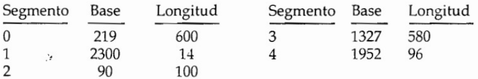

# **Solución Investigación 08**

## **1. Explique la diferencia entre los conceptos de fragmentación interna y externa.**

- **Fragmentación Interna:** La fragmentación interna ocurre cuando hay un desperdicio de memoria dentro de un bloque o segmento asignado a un proceso. Se produce cuando se asigna un bloque de memoria a un proceso que es mayor que el tamaño requerido por el proceso. Como resultado, parte de ese bloque de memoria queda sin utilizar y se desperdicia. La fragmentación interna puede ocurrir en sistemas que asignan memoria en unidades fijas, como la asignación basada en particiones fijas. El espacio no utilizado dentro de un bloque debido a la diferencia entre el tamaño requerido por el proceso y el tamaño del bloque asignado se considera fragmentación interna.

- **Fragmentación Externa:** La fragmentación externa ocurre cuando hay suficiente memoria total disponible para satisfacer las solicitudes individuales de procesos, pero no se puede asignar memoria contigua debido a la distribución fragmentada de los bloques de memoria. En otras palabras, hay suficiente memoria disponible en el sistema, pero está dispersa en pequeños bloques no contiguos. Como resultado, puede haber situaciones en las que no se pueda asignar suficiente memoria contigua para satisfacer una solicitud de proceso específica, aunque haya suficiente memoria total disponible. La fragmentación externa suele ser un problema en sistemas que utilizan asignación dinámica de memoria, como la asignación basada en particiones variables o la asignación basada en paginación.

## **2. ¿En que forma el editor de montaje cambia el acoplamiento de las instrucciones y los datos a direcciones de memoria?**

El editor de montaje cambia el acoplamiento de las instrucciones y los datos a direcciones de memoria de varias formas:

- **Resolución de símbolos:** Durante el proceso de enlace, el editor de montaje busca y resuelve los símbolos utilizados en las instrucciones y los datos. Esto implica asociar cada símbolo con una dirección de memoria específica en el programa final. De esta manera, las referencias a símbolos en el código fuente se transforman en direcciones de memoria reales.

- **Asignación de direcciones:** El editor de montaje asigna direcciones de memoria a las instrucciones y los datos del programa. Esto implica decidir en qué ubicación de memoria se almacenarán las instrucciones y los datos, teniendo en cuenta la estructura del programa y las restricciones del sistema operativo. El editor de montaje asigna direcciones de memoria contiguas o dispersas según sea necesario.

- **Resolución de referencias:** Si el programa hace referencia a instrucciones o datos en otros módulos o bibliotecas, el editor de montaje se encarga de resolver esas referencias. Esto implica determinar las direcciones de memoria correspondientes a las instrucciones o datos externos y actualizar las referencias en el programa para que apunten a las ubicaciones de memoria correctas.

## **3. ¿Que información debe pasar el compilador al editor de montaje para facilitar el acoplamiento de memoria de éste?**

- **Código objeto:** El compilador genera el código objeto correspondiente al programa o módulo de código fuente compilado. Este código objeto contiene las instrucciones y los datos en una forma que puede ser procesada por el editor de montaje. El código objeto puede incluir información sobre símbolos, direcciones de memoria relativas, referencias a instrucciones o datos externos, entre otros detalles relevantes.

- **Tabla de símbolos:** El compilador crea una tabla de símbolos que mapea los nombres de los símbolos utilizados en el código fuente a direcciones de memoria o ubicaciones relativas en el código objeto. Esta tabla de símbolos es utilizada por el editor de montaje para resolver los símbolos y asignarles direcciones de memoria reales.

- **Información de enlace:** Si el programa hace referencia a instrucciones o datos externos provenientes de otros módulos o bibliotecas, el compilador puede proporcionar información de enlace que indique cómo se deben resolver esas referencias. Esta información puede incluir detalles sobre los módulos o bibliotecas utilizadas, nombres de símbolos externos y ubicaciones de memoria correspondientes.

- **Directivas de asignación de memoria:** El compilador puede incluir directivas especiales o metadatos que indiquen al editor de montaje cómo se deben asignar las direcciones de memoria para diferentes secciones del programa, como el código, los datos estáticos, las pilas, entre otros. Estas directivas pueden ayudar a optimizar el acoplamiento de memoria y garantizar una organización eficiente de los recursos.

## **4. En el siguiente orden, se tienen cinco particiones de memoria de 100 KB, 500 KB, 200 KB, 300KB, y 600 KB. ¿Como situarían en memoria una serie de procesos de 212 KB, 417 KB, 112 KB y 426 KB en ese orden con los algoritmos de primer ajuste, mejor ajuste y peor ajuste? ¿Que algoritmo hace el uso más eficiente de la memoria?**

- ### ***Primer ajuste:***

Proceso de 212 KB: Se asignaría a la partición de 500 KB (se utiliza la primera partición lo suficientemente grande para el proceso).
Proceso de 417 KB: Se asignaría a la partición de 600 KB (se utiliza la primera partición lo suficientemente grande para el proceso).
Proceso de 112 KB: Se asignaría a la partición de 200 KB (se utiliza la primera partición lo suficientemente grande para el proceso).
Proceso de 426 KB: No hay ninguna partición lo suficientemente grande para el proceso. Se produce fragmentación externa y el proceso no se puede asignar.

- ### ***Mejor ajuste:***

Proceso de 212 KB: Se asignaría a la partición de 300 KB (se utiliza la partición más cercana en tamaño al proceso).
Proceso de 417 KB: Se asignaría a la partición de 500 KB (se utiliza la partición más cercana en tamaño al proceso).
Proceso de 112 KB: Se asignaría a la partición de 200 KB (se utiliza la partición más cercana en tamaño al proceso).
Proceso de 426 KB: Se asignaría a la partición de 600 KB (se utiliza la partición más cercana en tamaño al proceso).

- ### ***Peor ajuste:***

Proceso de 212 KB: Se asignaría a la partición de 600 KB (se utiliza la partición más grande disponible).
Proceso de 417 KB: Se asignaría a la partición de 600 KB (se utiliza la partición más grande disponible).
Proceso de 112 KB: Se asignaría a la partición de 500 KB (se utiliza la partición más grande disponible).
Proceso de 426 KB: Se asignaría a la partición de 600 KB (se utiliza la partición más grande disponible).

## **5. La mayoría de OS permiten a los programas asignar más memoria a su espacio de direcciones durante la ejecución. ¿Que se necesitaría para soportar la asignación dinámica de memoria en los siguientes esquemas?**
### **1. Asignación contigua de memoria:**

* Un algoritmo de asignación de memoria dinámica que permita reservar y liberar bloques de memoria de manera flexible.
* Un sistema de gestión de fragmentación para evitar la fragmentación interna y externa.
* Un mecanismo para ajustar el espacio de direcciones de los programas en tiempo de ejecución, como el uso de punteros o registros especiales que apunten al límite actual de la memoria asignada al programa.

### **2. Segmentación pura:**

* Un gestor de tablas de segmentos que controle la asignación y liberación de segmentos de memoria.
* Un algoritmo de asignación de segmentos dinámicos que pueda encontrar un segmento de memoria adecuado y asignarlo al programa solicitante.
* Un mecanismo para ajustar el tamaño de los segmentos asignados, permitiendo que los programas soliciten más memoria durante la ejecución.

### **3. Paginación pura:**

* Un gestor de tablas de páginas que controle la asignación y liberación de páginas de memoria.
* Un algoritmo de asignación de páginas dinámicas que pueda encontrar y asignar páginas de memoria disponibles al programa solicitante.
* Un mecanismo para ajustar el tamaño del espacio de direcciones del programa, permitiendo la asignación de más páginas de memoria según sea necesario durante la ejecución.

## **6. Compare los esquemas de organización de la memoria principal basados en una asignación continua de memoria, en una segmentación pura y una paginación pura con respecto a:**

### **Fragmentación externa:**
* Asignación continua de memoria: Este esquema puede experimentar fragmentación externa, ya que los procesos se asignan en bloques contiguos de memoria y pueden dejar espacios vacíos entre ellos. Estos espacios no utilizados, aunque sean pequeños, pueden acumularse con el tiempo y provocar una fragmentación externa significativa.
* Segmentación pura: En este esquema, la fragmentación externa es mínima o inexistente, ya que los segmentos de memoria se asignan de manera independiente y no se requiere contigüidad física. Cada segmento se asigna según su tamaño específico, lo que evita la formación de espacios no utilizados entre los segmentos.
* Paginación pura: La paginación también tiende a tener poca o ninguna fragmentación externa. Las páginas de memoria se asignan de forma independiente y no es necesario que estén contiguas físicamente. Esto permite que las páginas se asignen de manera flexible, sin dejar espacios vacíos entre ellas.

### **Fragmentación interna:**
* Asignación continua de memoria: Este esquema puede sufrir de fragmentación interna, ya que los procesos se asignan en bloques de memoria contiguos y pueden ocupar más espacio del necesario debido a los requisitos de alineación. Esto puede resultar en una cantidad significativa de memoria desaprovechada en forma de fragmentación interna.
* Segmentación pura: La segmentación pura también puede experimentar fragmentación interna. Cada segmento se asigna según su tamaño, lo que puede llevar a que un segmento ocupe más espacio del necesario, generando fragmentación interna.
* Paginación pura: La paginación pura tiene un riesgo mínimo de fragmentación interna. Las páginas de memoria se dividen en unidades fijas y los procesos se asignan en múltiples páginas. Como las páginas tienen un tamaño constante, no hay fragmentación interna dentro de una página. Sin embargo, puede haber fragmentación interna si un proceso no utiliza completamente la última página asignada.

### **Capacidad de compartir código:**
* Asignación continua de memoria: En este esquema, compartir código puede ser complicado debido a la contigüidad requerida. Para compartir código, los procesos deben asignarse en áreas de memoria físicamente contiguas para que puedan acceder y ejecutar el mismo código compartido.
* Segmentación pura: La segmentación pura facilita la capacidad de compartir código, ya que los segmentos de código pueden asignarse de manera independiente a diferentes procesos. Los procesos pueden tener segmentos de código comunes que se comparten sin problemas, lo que permite un uso eficiente de la memoria y la capacidad de ejecutar el mismo código en varios procesos.
* Paginación pura: La paginación también facilita el compartir código. Las páginas de código se asignan de forma independiente y no se requiere contigüidad física. Por lo tanto, múltiples procesos pueden tener sus propias tablas de páginas con páginas de código compartidas, lo que permite una fácil compartición de código entre procesos. Esto mejora la eficiencia del uso de memoria y permite una mayor capacidad de compartir código en comparación con la asignación continua de memoria.

## **7. En un OS con paginación, un proceso no puede acceder a una zona de memoria que no sea de su propiedad.**
- ***1. ¿Por qué?*** Se debe a que cada proceso tiene su propio espacio de direcciones virtuales, dividido en páginas con permisos de acceso controlados por el sistema operativo. Esto garantiza que un proceso no pueda acceder a una zona de memoria que no le pertenece, ya que se implementa protección de memoria para mantener la seguridad y el aislamiento entre los procesos. Para permitir el acceso a otras zonas de memoria, el sistema operativo tendría que ajustar los permisos de acceso o establecer mecanismos explícitos de compartición de memoria, pero esto debe realizarse con precaución debido a los posibles riesgos y compromisos de seguridad que puede conllevar.
- ***2. ¿Como podía el OS permitir el acceso a otras zonas de memoria?*** El sistema operativo ofrece la posibilidad de acceder a otras zonas de memoria mediante la compartición de memoria, la cual implica asignar páginas compartidas que pueden ser accedidas y modificadas por varios procesos. Para lograr esto, se utilizan mecanismos de sincronización y comunicación entre procesos, como semáforos o mutex. Además, se puede emplear el paso de mensajes entre procesos, donde la comunicación se realiza a través del envío de mensajes con datos específicos en lugar de acceder directamente a la memoria de otros procesos. Estas estrategias aseguran un mayor control y seguridad en el acceso a la memoria de otros procesos.
- ***3. ¿Por qué debería o por qué no debería?*** La determinación de permitir o restringir el acceso a otras áreas de memoria se basa en consideraciones fundamentales como la seguridad y la privacidad. Es crucial salvaguardar la integridad y confidencialidad de los datos, evitando así la exposición de información sensible. Estos aspectos se convierten en elementos determinantes para tomar decisiones que garanticen la protección adecuada de la memoria y la preservación de la privacidad del sistema.

## **8. Compare el mecanismo de paginación con el de segmentación con respecto a la cantidad de memoria requerida por las estructuras de producción de direcciones para convertir las direcciones virtuales en direcciones físicas.**

- **Paginación:** Se utiliza una tabla de páginas que mapea las direcciones virtuales a las direcciones físicas correspondientes. Esta tabla de páginas es de tamaño fijo y contiene entradas para cada página de memoria virtual. La cantidad de memoria requerida para la tabla de páginas depende del tamaño del espacio de direcciones virtuales y del tamaño de las páginas utilizadas. Si el espacio de direcciones virtuales es grande o si se utilizan páginas de tamaño pequeño, la tabla de páginas puede ocupar una cantidad significativa de memoria.

- **Segmentación:** Se utiliza una tabla de segmentos que mapea los segmentos de memoria virtuales a las direcciones físicas correspondientes. Cada entrada en la tabla de segmentos contiene información sobre el tamaño y la ubicación de cada segmento. La cantidad de memoria requerida para la tabla de segmentos depende del número de segmentos utilizados y de su tamaño. Si hay muchos segmentos o si los segmentos son grandes, la tabla de segmentos puede ocupar una cantidad considerable de memoria.

## **9. Considere la tabla de segmento dada en el formato del taller y responda: ¿Cuales son las direcciones físicas para las siguientes direcciones lógicas?**

- 1. 0. 430: La dirección física sería: (0, 649) lo cual se encuentra dentro del rango del segmento 0.
- 2. 1. 10: La dirección física sería: (1, 2310) lo cual se encuentra dentro del rango del segmento 1.
- 3. 2. 500: Por la longitud del segmento 2, de sólo 100, no se podría almacenar. No existe dirección lógica.
- 4. 3. 400: La dirección física sería: (3, 1727) lo cual se encuentra dentro del rango del segmento 0.
- 5. 4. 11: Por la longitud del segmento 5, de sólo 96, no se podría almacenar. No existe dirección lógica.
